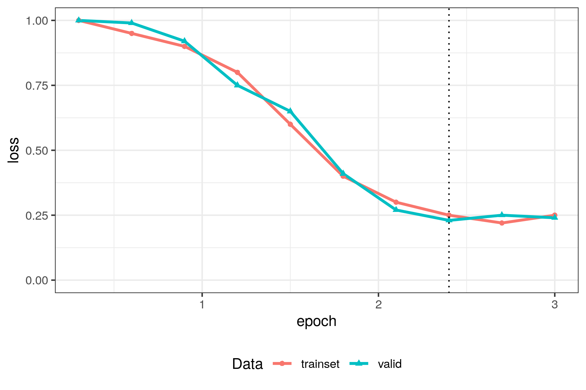
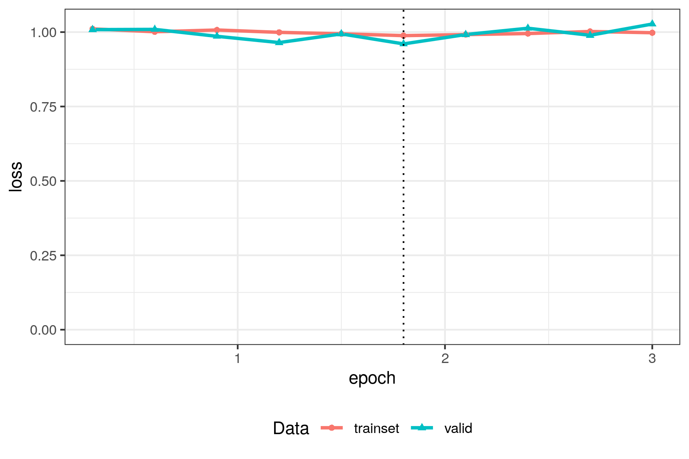
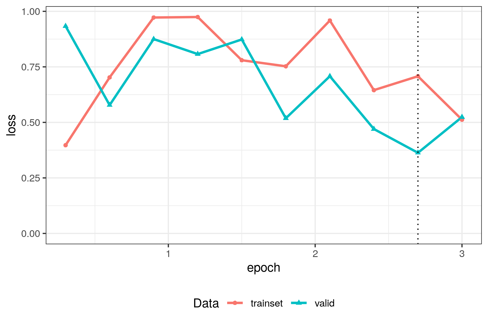

# General concepts in Active Tigger

## Train, Validation and Test sets

In supervised machine learning (aka predictive models), it is common practice to split your dataset into [three subsets](https://en.wikipedia.org/wiki/Training%2C_validation%2C_and_test_sets): the training, validation, and test sets. The reason for this is to control [overfitting](https://en.wikipedia.org/wiki/Overfitting), which happens when a predictive model performs well on its training set, but fails to generalize to new inputs.

Each set plays a different role: 

- train set: this set that will be used to train models[^1].
- validation set: this set used to compare model performances across hyperparameters. 
- test set: this set is used to evaluate the generalization quality of your final model. Do not use this choose models, otherwise your evaluation scores will not be valid (see [Goodhart's law](https://en.wikipedia.org/wiki/Goodhart's_law)). 

[^1]: Note that this set is itself split into a main training and a train-eval subset (usually 80%-20%). The train-eval subset is used to evaluate the model's generalization capabilities during training. The combination of the train subset and the train-eval subset makes choosing hyperparameters easier. See [Reading the loss curve](#reading-the-loss-curve).

In Active Tigger, we enforce some "good practice" measures:

- Splitting is performed at [project creation](../functionalities/project-creation.md), so that the choice of validation and test sets is not influenced by choices made during annotation of the training set.
- Model predictions and active learning features are not available when annotating the validation and test sets, to prevent the annotator from being influenced by model predictions.
- By default, splitting is performed using uniform random sampling. [Additional options exist](../functionalities/project-creation.md#secondary-parameters) to control the sampling process such as [Stratification](./glossary.md#dataset-stratification).

!!! Note
    
    The dataset is split upon [project creation](../functionalities/project-creation.md). Sets can be modified in the [Settings](../functionalities/settings.md). Validation and Test sets are optional, but they are strongly recommended if your goal is to train predictive models.

## Representing texts with Features

When using machine learning in text analysis settings, the first step is always to transform each text input into a vector of numbers, which are called its Features.

These features can be used to compute visualizations, fit topic models or quick models. Note that BERT models (and generative LLMs) compute their own features internally, so you don't need to compute your own features to use them.

In Active Tigger, there are five kinds of features, which can be created in the [Settings](../functionalities/settings.md#features) tab:

- Sentence embeddings: Computed with transformer models, this is the most advanced method for representing each text input [^3] as a vector, because it works on the whole text instead of word by word. As for all transformer models, each model has a [maximum window size](./glossary.md#tokens-and-window-sizes).
- FastText: Each text input is first split into words (using the [SpaCy](https://spacy.io/) tokenizer), then each word is represented by a pre-computed embedding, and the final text embedding is computed as the average of all its word embeddings. Note that this method does not take into account the order in which the words appear. See the [fastText](https://fasttext.cc) webpage for details.
- DFM (document-feature matrix): historically, a cornerstone of text representation before the advent of word- and sentence embeddings. Each text is represented by the frequency of each word that appears in it: all texts are first split into words (using the [SpaCy](https://spacy.io/) tokenizer), and a large matrix is calculated, where for a given row (=document) and column (=word), the value represents the number of time the word appeared in the document. Several options are available for determining which words to exclude, and how to re-weight these raw frequencies using the tf-idf method, see [Settings page](../functionalities/settings.md#features).
- Regex (regular expression): For a given regex, the feature is either a single binary variable, reporting if the regex was found in the text input, or a numeric value indicating the number of times it was found in the input.
- dataset: Import a column of your dataset as a feature. This can be useful when training quick models, for instance if you have a variable that measures the number of characters, or the text's source.

[^3]: Not necessarily a sentence, a text input can be a whole paragraph.

!!! Note
    
    Several types of features (Sentence embeddings, Regex...) can be used simultaneously for computing visualizations or quick models. They will just be concatenated into a single large vector.

## What is Active Learning ?

Active learning is a method to increase annotation efficiency, it lowers the number of annotations necessary to train performant models. 

The key idea: Instead of picking texts at random when choosing which one to annotate next, the algorithm picks the one that is the most ambiguous for the current prediction model, which is more likely to help it get better during the next training. Mathematically, this ambiguity is computed by the model's prediction entropy for each text, which is lowest when all the probability is assigned to a single label, and highest when it is spread evenly across all labels.

An additional benefit of active learning is that it challenges the definition of each label forcing annotators to refine the codebook.

Active learning can be used with [quick models](#training-quick-models) and [BERT model](#what-are-bert-models), and can be turned on and off in the [Annotation page](../functionalities/annotate.md#active-learning-in-practice). If your ultimate goal is to train a BERT model, it is recommended to start by active learning with quick models until enough texts have been annotated to train a BERT model, and then switch to active learning with your latest BERT model.

## Training Quick models

Quick models are standard supervised machine learning models, trained on [features](#representing-texts-with-features) in order to predict labels. 
Compared to BERT models, they are lightweight and quick to train, hence their name. 
They are typically used in the early stages of annotation, as described in the workflow above. 
See to [Model page](../functionalities/model.md) for more details on how to train quick models.

## Training BERT models

### What are BERT models?

[BERT models](https://en.wikipedia.org/wiki/BERT_(language_model)) are powerful predictive models that you can use in order to generalize your annotations to a larger corpus (either your project's dataset, or an external one, see [Export page](../functionalities/export.md)).

They are pre-trained encoder language models[^4], meaning that they have been trained on very large corpora in order to encapsulate semantic "understanding". These models must be fine-tuned in order to adapt to a given task.

[^4]: As opposed to decoder models i.e. generative models, encoder models' only goal is to create an embedding space that encapsulates semantic properties that are relevant to downstream tasks (eg. classification).

Fine-tuning a BERT model is the process of adjusting its internal weights using optimization algorithms[^5] to minimize a given cost function. This is a delicate art, involving a trial-and-error in order to find the [best hyperparameters](#which-hyper-parameters-to-choose), typically by reading the [loss curve](#reading-the-loss-curve). There are many resources if you want to learn more about fine-tuning neural networks, both online and in handbooks; see [this video](https://youtu.be/IHZwWFHWa-w?si=WOzTeU4U6b62uq_s) for a great introduction.

[^5]: As usual with neural networks, they are trained by a form of [gradient descent](https://en.wikipedia.org/wiki/Gradient_descent). The current standard algorithm for fine-tuning BERT models is AdamW.

### Which model to choose?

<!-- should it live in the FAQ? -->

There are many different pre-trained models to choose from, hosted on the [Huggingface](https://huggingface.co/) website.
The main difference between them is the corpus they have been pre-trained on (most of them are specialized in a single language), and their inner architecture (which among others determines the [window size](./glossary.md#tokens-and-window-sizes)).
There is no golden rule for which model to choose: try different ones, and see which one works best on your data.

### Reading the loss curve

The loss curve provides key insights on how efficient the training was. It represents the evaluation of the [loss function](https://en.wikipedia.org/wiki/Loss_function) on the train and the eval-train set across training steps/epochs.

Here are some general rules for obtaining a good model while avoiding [overfitting](https://en.wikipedia.org/wiki/Overfitting). Refer to [quality scores](./glossary.md#model-quality-scores) for more insightful metrics on the model's performance.

#### Just right

This is what you want to see:

- Both curves went down during training: the model has learned
- Both curves have the same loss values: no overfitting
- The curves are flat at the end: nothing more to be learned, apparently

Now you can have a look at the evaluation metrics to see if you are satisfied with the prediction quality. If not, annotate more training data.

#### Overfitting

The model has overfitted:

- Both curves went down during training: the model has learned
- But the training curve is much lower than the evaluation curve

What to do:

- choose a lower learning rate, for slower weight updates
- use larger batches[^6], in order to smooth training over more examples per training step
- choose a higher weight decay: this will prevent the weights from getting too large
- annotate more data, you may not have enough examples for the model to learn from

[^6]: The effective batch size is the system batch size times the gradient accumulation.

#### Underfitting

The model has underfitted:
- Both curves are flat, the model hasn't learned at all

What to do:

- choose a higher learning rate, for faster weight updates
- use smaller batches, as this will result in more training steps
- choose a lower weight decay: too high regularization can prevent proper learning
- annotate more data, you may not have enough examples for the model to learn from

#### Incomplete learning

The model could learn more:

- Both curves went down during training: the model has learned
- Both curves have the same loss values: no overfitting
- But there is no plateau at the end, the curves are still going down

What to do:

- use more epochs, to give the model time to learn more
- choose a higher learning rate, for faster weight updates
- use smaller batches, as this will result in more training steps
- choose a lower weight decay: too high regularization can prevent proper learning

#### Chaotic learning

The model is trying to learn too fast:

- Curves should be going down, not up and down
- Some learning has occurred, but you can probably do better

What to do:

- choose a lower learning rate, for slower weight updates
- use larger batches, in order to smooth training over more examples per training step
- choose a higher weight decay: this will prevent the weights from getting too large
- annotate more data, you may not have enough examples for the model to learn from

### Which hyper-parameters to choose?

<!-- AM: it is unclear if it is pedagogical material (in which case, this table is coherent) or descriptive material, (in which case it should live in the functionalities section) JB: agreed, I think it is pedagogical material, so it could stay here and replace the list of ../functionalities/model.md#bertmodel (adding some of the references here) -->

**Base parameters**

|Name|Type|Description|Typical value|
|---|---|---|---|
|Model base|General|Which pre-trained model will be fine-tuned. Larger models need more training data.||
|Max context window|General|The number of *tokens* that will be used during training for each text.   Lower values make training faster and use less memory.||
|Epochs|General|The number of times your training data will be presented to the model|3|
|Learning rate|General / Regularization|How much the model's weights will be changed at each step|5e-6 to 5e-4|
|Weight decay|Regularization|Prevents model weights to become too high|0.01|

**Advanced parameters**

|Name|Type|Description|Typical values|
|---|---|---|---|
|Total batch size|General / Regularization|How many training examples are presented at each step. Total batch size = Batch size x Gradient accumulation.|8-64 (16)|
|Batch size|General / Regularization|Number of examples that are loaded in memory at any one time.|1-64 (16)|
|Gradient accumulation|General / Regularization|Number of batches accumulated to perform a gradient descent step. Use higher values for small GPUs.|1-64 (1)|
|Eval|General|Number of times the model will be evaluated on the evaluation set during training (aka checkpoints).|9|
|Train-eval split size|General|Portion of the data that will be used for evaluation during training.|0.2|
|Balance classes|General|Whether to use only the number of observations of the smallest class during training.|Deactivated|
|Loss|General|Which loss function is optimized: use Weighted cross entropy for unbalanced class|Cross entropy|
|Keep the best model|General|Whether to keep the best checkpoint according to evaluation loss, instead of the final checkpoint.|Activated|
|Class threshold|Data|Minimum number of observations for a class to be used during training. Use higher values to exclude small classes.|1|
|Labels to ignore|Data|Which classes to ignore during training|None|

## Projections

A projection is a 2D (dimensional reduction)[https://en.wikipedia.org/wiki/Dimensionality_reduction] of your training data, used for visualization (in the [Explore](../functionalities/explore.md) page).

It uses an unsupervised model in order to reduce a high-dimensional [set of features](#representing-texts-with-features) to two dimensions: similar texts will be grouped together.

The resulting visualization will help detecting outliers, and will group texts according to general themes. <!-- yes, but also, no... JB: what do you mean? -->

In classification workflows, it is recommended to use projections to get a first overview of your corpus, and to determine whether you need to perform some more cleaning and filtering before annotating texts and training models.

Note that the placement of texts in the visualization does not tell you everything you want to know about your corpus, it is simply a representation of the main structural traits of your chosen features.
This reflects the difference between unsupervised and supervised learning: unsupervised learning is only based on features, while supervised learning is meant to find the relationship between features and labels.
In many cases, different annotations will appear close together in the projection: this means that your classification scheme goes beyond topic modeling.

## Topic models

A topic model is an unsupervised model meant to capture the main themes that are present in a corpus, based on text [features](#representing-texts-with-features).

Active Tigger features BERTopic models, which work in three successive steps: first an (embedding)[#representing-texts-with-features] step using sentence transformers, then a dimensionality reduction step (just as in (projections)[#projections], but usually in more than 2 dimensions), and then a clustering step.

Topic modeling can either be an end in itself, or a useful step in an annotation/prediction workflow. For more details on how to use it in Active Tigger, see [here](../functionalities/explore.md#topic-model).

