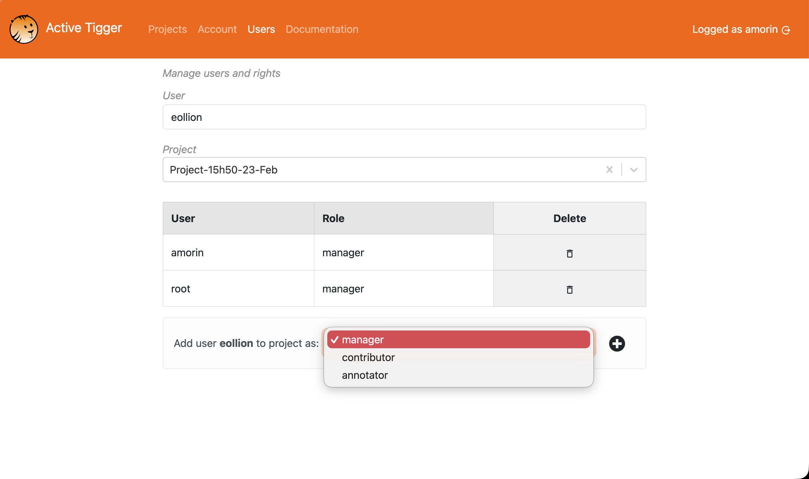

This section describes how to manage user account and create users

## Account page

The account page allows user to change their password. If you have forgotten your password, please reach out to the instance manager.

## Users page

This page allows users to manage collaboration rights across people and projects.

Three roles are defined with different rights: 

- root: Only one root account. This user can manage the rights of anyone and has access to **ALL** projects as a manager. Root has also access to the [Monitor page](#monitor-page).
- manager: Default role when creating a project. Managers have access to the data, can annotate, train models, compute features, and delete anything. 
- collaborator: Collaborators have the same rights as mangers but cannot delete anything.
- annotator: Annotators only have access to the [Codebook page](./codebook.md), [Explore page](./explore.md) and the [Annotate page](./annotate.md).

Each role is project dependant and can be managed by managers of a project. After selecting the appropriate project, they can type the name of a user and grant them the appropriate rights.
