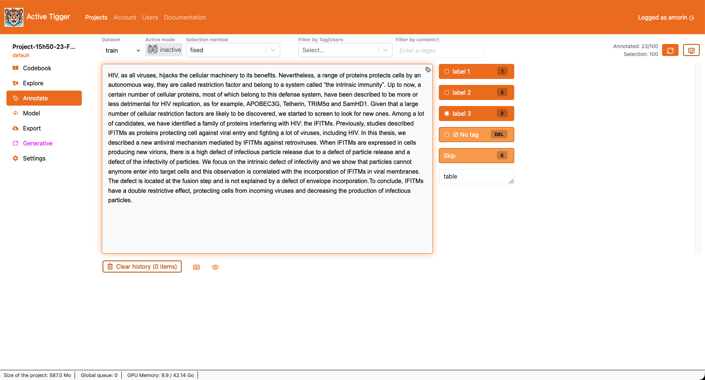

# Annotate page

The annotate panel is the main page of the app to annotate your text data. 

## Selecting text inputs to annotate

There are several ways to select a subset of text inputs.

- Dataset: Select the dataset on which you are working (train, validation or test).
- Selection mode: Change the order in which elements are showed (fixed, or random).
- Active Mode: Allows to choose a model for Active Learning ([concept](../theoretical-concepts/index.md#what-is-active-learning), [on the page](#active-learning-in-practice)). This unlocks new selection modes: 
    - active: orders the text inputs by decreasing entropy.
    - Max prob LABEL: orders the text inputs by decreasing probability to be of label LABEL.
    - Min prob LABEL: order the text inputs by increasing probability to be of label LABEL ⚠️ This mode also filters text inputs leaving only those which have been labeled as LABEL by the model.
- <a class="parameter">Filter by Tag/User</a>: Only displays elements already have label (by current user) or don't, are tagged with a specific LABEL, or by a certain user ("by USER"). 
- <a class="parameter">Filter by content</a>: Only displays elements with specific characteristis
    - Being labeled with LABEL
    - Being labeled by a user
    - With comments
    - Predicted as LABEL by current active model
    - Matching a search / regex expression

After setting a new dataset/selection method/filter,  will apply the changes and fetch a new element.

!!!Tip
    Max prob LABEL is especially useful  in the early stages when the model fails with confidence.

## Annotation panel

The center of the page displays the text box as well as several buttons: 

- LABEL: To tag the text input with the given LABEL and move on to the next text input.
-  No tag: if a tag exists, remove it and move on to the next text input.
- Skip: Move on to the next text input without altering the annotation.

The "Comment" section allows to save a comment with the annotation of the text input.

### Display parameters

 opens a modal to modify the annotation panel display.

- Annotation History: to display previous annotations of the given text input.
- Existing annotation: to display existing annotation on the current text input. XXX do you see other people's label ? can't remember
- Show prediction stats: to display a button for the label predicted by the model, bound the the hotkey "P" (if Active Mode is on).
- Show prediction stats: to display the model's probability as well as the predicted label (if Active Mode is on).
- Element history: to display previous tags at the bottom of the text box.
- Tokens approximation: Approximate extimation of text truncation. Given a window size, text inputs exceeding this limit will be written in another column to emphasise possible truncation. This parameter is only visual and has no other impact.
- Height: to set the height of the text box.
- Width: to set the width of the text box.
- Force one column layout: to display the label buttons in a column.
- Highlight words in the text Similar to Filter by content but without removing items not containing the regex expression.

### Annotation history

The last 100 text inputs annotated are visible underdeath the annotation page. For Active Learning to work best, the application retains, at all time, the list of text inputs annotated. This way, unless you Clear history, these elements will not be shown again.

### Active Learning in practice

*Read about the concept of [Active learning](../theoretical-concepts/index.md#what-is-active-learning)*

In the Annotate page, you can select a model (quick or BERT) to use its predictions for .  
Quick models can be  retrained or  unselected.  
To use BERT models in active learning, you must first compute the predictions on the dataset, in the [Evaluate tab](./model.md#evaluation) Compute statistics on current annotations.

Active Learning. Models trained on a reduced number of labels can be used, they will simply ignore unseen labels.

## Curate
<!-- TODO -->

## Annotate (multi-label)

The general layout is unchanged, to annotate elements, select one or more label in the dropdown menu and  to save the annotation and move on to the next text input.

## Annotate (span)

To annotate the text, first select a LABEL, then highlight the text in the text box. Click on the highlight to remove.  Validate the annotation to save the annotation and move on to the next text input.