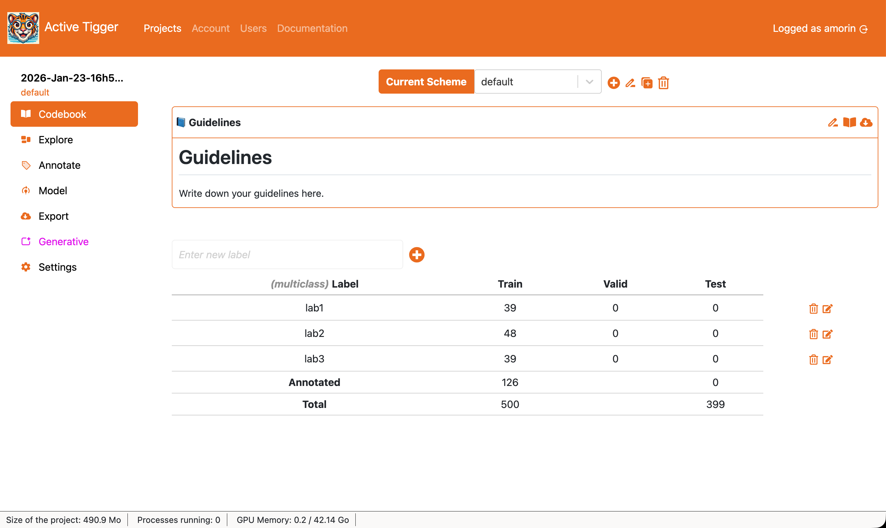

# Codebook Page

This section describes the Codebook page, the key elements and their interactions with the rest of the application.

## Scheme management

At the top of the screen, you will find the scheme ([what is a scheme?](../theoretical-concepts/glossary.md#schemes)) management component. It consists of a dropdown menu and 4 actions buttons. 

- Current scheme: Scheme to use for the current session.
-  to create a new scheme, with a unique name and a type ([see available types](../theoretical-concepts/glossary.md#schemes))
-  to rename the current scheme.
-  to duplicate the current scheme with all annotations. 
-  to delete the current scheme and its annotations. **This action is definitive.**

## Guidelines

Codebook allows to keep information on how to use the current scheme ([How to write a codebook](XXX)). 

-  to access edition mode.
-  to open the Codebook in a browser tab to access it during annotation.
-  to download the Codebook as a markdown file.

## Labels management

- New label name  to create a new label.
-  to delete the specific label
-  to rename the specific label (you can use to merge annotations with another label) 

The table summarizes existing labels in the current scheme, the distribution of annotations for each dataset (train, valid and test). The rows can be re-ordered, the order of the rows will manage the order of the labels in the [Annotate Page](./annotate.md)