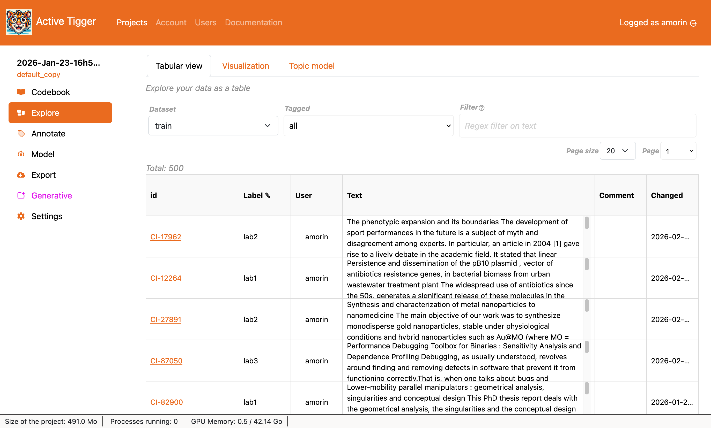
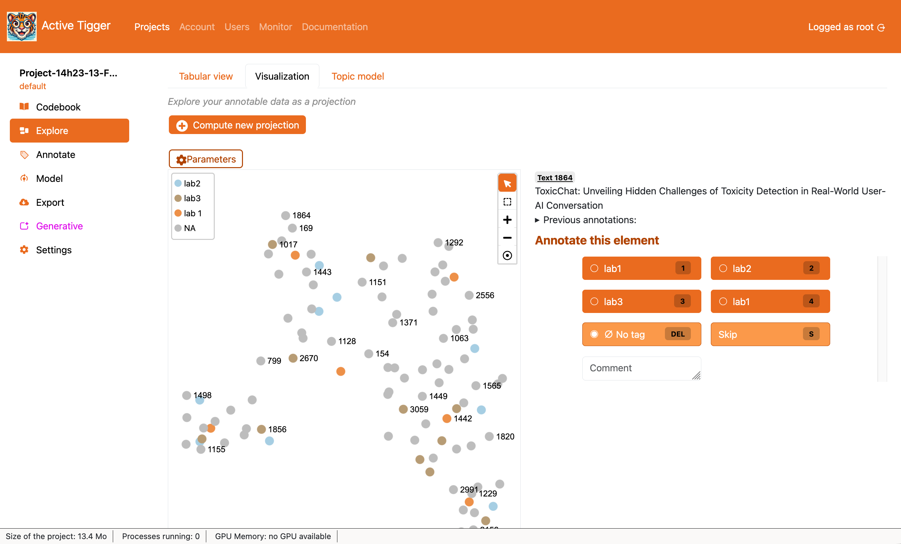
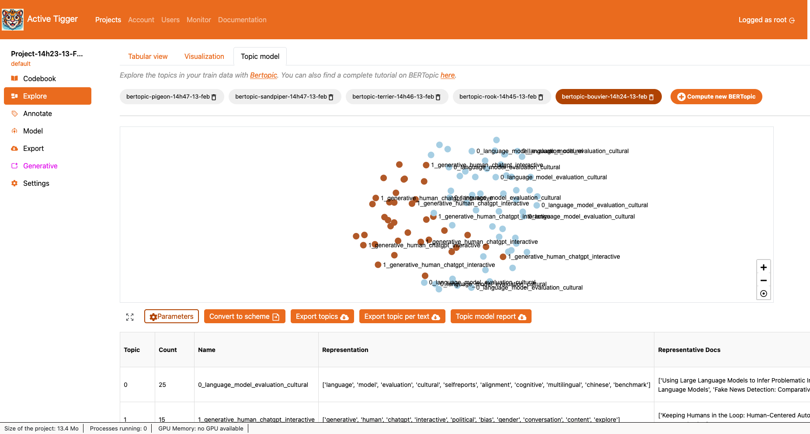

# Explore Page

This section describes each of the three tabs found in the Explore Page.

## Tabular View

The tabular view displays your data in a tabular view. Filters are available to assist your exploration.

- Filters available
    - Select the dataset to explore ("train", "valid" or "test").
    - Select elements with a tag.
    - Select elements given a regex query.
- The table: The table contains 6 columns including the id, the label, the user who produced the label, the text, any comment and the date the label was produced.
    - Click on the id to go to the [Annotate page](./annotate.md) and annotate the text input.
    - Click on the label to annotate in the tabular view. Click Validate changes to save changes in the database.

## Visualization

The visualization tab displays a projection of the embedding space in two dimension ([what is a projection?](../theoretical-concepts/index.md#projections)). Projection computed with either [UMAP](https://pair-code.github.io/understanding-umap/) or [t-SNE](https://en.wikipedia.org/wiki/T-distributed_stochastic_neighbor_embedding). 

!!! warning 
    There is only one projection per project. 
    Computing a new projection will overwrite the current projection.

- Compute new projection
    - Select a feature: choose the set of feature ([what are features?](../theoretical-concepts/index.md#representing-texts-with-features))to use for the projection. If choosing several sets of features, they will be concatenated before projection. Add a new feature to [Compute new features](../functionalities/settings.md#features).
    - When using **UMAP**:
        - n neighbors:
        - min distance:
    - When using **t-SNE**:
        - perplexity: XXX
        - learning rate: XXX
        - init: XXX
    - Feature scaling: this is a method normalizes the range of independant variables (i.e. each feature) ([should I scale my features?](../faq/faq.md#should-i-scale-my-features)).
- Parameters to see the parameters of the current projection.
- The visualization panel displays each text input in a 2D space. The color of the node depends on the label, _or the absence thereof_. 
    -  to select a subset of text inputs.
    -  removes the frame.
    - _If a frame exists_,  Lock the selection to lock on the frame. Going to the [Annotate page](./annotate.md) will only display elements in the frame.
    - Clicking a node displays the text input as well asprevious annotations and the [Annotation Panel](./annotate.md#annotation-panel), much like in the [Annotation page](./annotate.md)

Projections can be downloaded from the [Export page](./export.md#features).

## Topic model

The topic model ([what is a topic model?](../theoretical-concepts/index.md#topic-models)) section displays existing topic models (for a given project and user ??? XXX) and allows to compute new ones [BERTopic](https://bertopic.com/)[^1]. 

[^1]: Find a full tutorial on BERTopic for the social science [here](https://www.css.cnrs.fr/the-general-inquirer-in-the-time-of-llms-a-bertopic-tutorial/).

- Compute new BERTopic to create a new topic model.
    - Name: must be unique (with regard to? unique at all or unique per project ? unique per project per user? XXX )
    - Embedding model: choose from the [available embedding models](../faq/faq.md#choose-models-made-available) to compute the embeddings that will be used for fitting the model. These embeddings will be computed if they do not exist already for a given dataset.
    - Number of neighbours: [UMAP parameter](https://pair-code.github.io/understanding-umap/) — a dimension reduction algorithm; low values will generate a topic model focusing on local structures (i.e. very specific topics) whereas higher values will generate a topic model focusing on the global structure (i.e. global topics) (more [here](https://css-polytechnique.github.io/css-ipp-materials/pages/techy-notes.html#tbl-umap-parameters)).
    - Min topic size: [HDBSCAN parameter](https://scikit-learn.org/stable/modules/generated/sklearn.cluster.HDBSCAN.html) — a clustering algorithm —, this parameters correspond to the minimum number of elements in a group to be considered a cluster, otherwise the group is considered as noise. Increasing this value will generate few large groups; decreasing this value will generate many small groups.
    - Outlier reduction: If set to True, all text inputs considered as noise will be added to the closest topic ([more info](https://css-polytechnique.github.io/css-ipp-materials/pages/techy-notes.html#reduce-outliers-strategies)).
    - Force compute embeddings: If set to True, the app will first generate the embeddings overwriting any existing embeddings. 
    - Input dataset: What dataset should be used to fit the model (train, train + test + valid or the complete dataset uploaded to the project).
    - Filter out texts of length lower than: Before fitting the model, exclude text inputs of length inferior to this value. 
    - Number of components: [UMAP parameter](https://pair-code.github.io/understanding-umap/) — a dimension reduction algorithm; it defines the number of dimension the algorithm reduces the embeddings to. Low values will flatten the representation of the input texts, whereas higher values maintain a richer representation (more [here](https://css-polytechnique.github.io/css-ipp-materials/pages/techy-notes.html#tbl-umap-parameters)).
- The visual representation of the topics displays each text input as a node with a color corresponding to the topic generated by the topic model.
- Parameters to see the parameters of the current topic model.
- Convert to scheme to create a [scheme](../theoretical-concepts/glossary.md#schemes) and assign labels using the topics generated. XXX Add NOTE REGARDING THE DANGERS OF DOING THAT
- Export topics to download (csv file) the topic table displayed underneath.
- Export topic per text to download a mapping of each element id[^2] to a the topic index.
- Topic model report to download an HTML report with key insights (topics description, 2D map, hierarchical representation, representative documents and the parameters of the model).
- The table (downloadable with Export topics) summarises the topic model. 
    - Topic: the topic id.
    - Count: the number of elements in the topic.
    - Name: A standard name for the topic.
    - Representation: A list of keywords that represent the topic.
    - Representative docs: A list of documents that are at the core of the topic generated.

[^2]: As set up when [creating a project](./project-creation.md).