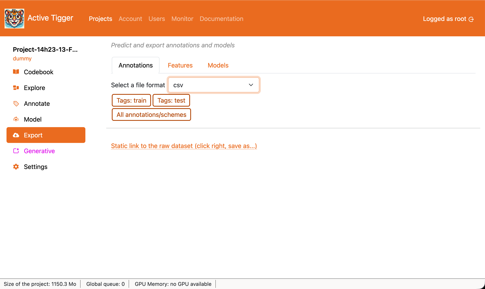
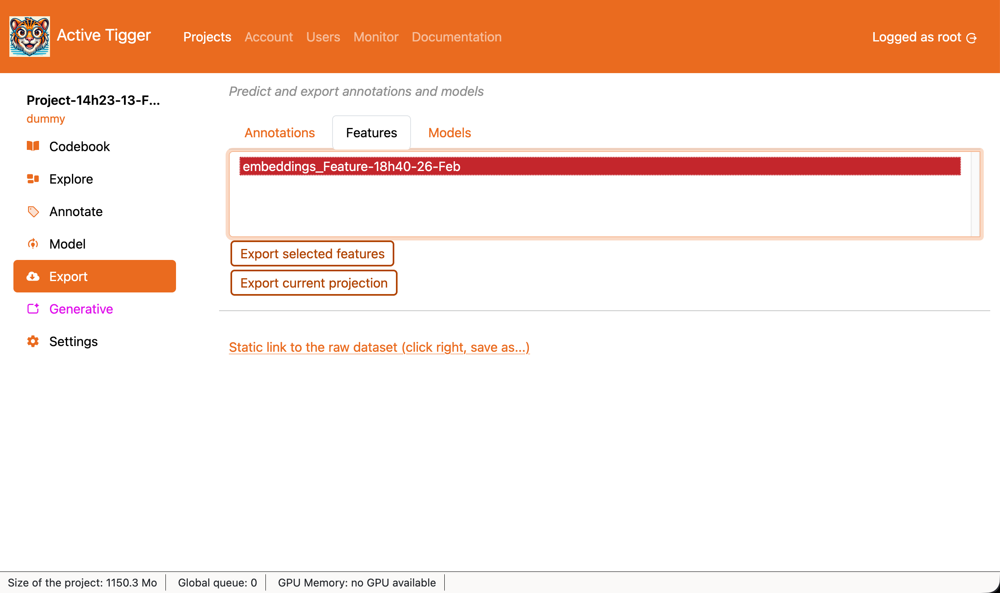
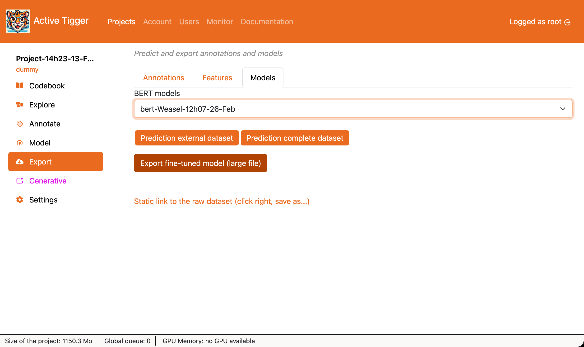

# Export page

This page describes the export possibilites.

## Annotations

This tab allows users to dowbload annotated datasets (train, test, validation or all )

- <a class="action primary">Tags: train</a>, <a class="action primary">Tags: test</a>, <a class="action primary">Tags: eval</a> to download the annotations for the train, test or valid dataset. Text inputs without an annotation are dropped. 
- <a class="action primary">All annotations schemes</a> to download the the full dataset (train, test and eval) with all columns from the original dataset and a column per scheme. Text inputs without annotations are included.
- <a class="action primary">Static link to the raw dataset (click right, save as...)</a> to download the the full dataset (as Parquet) as uploaded when creating the project.

## Features

- <a class="action primary">Export selected features</a> to download the features and the corresponding index.
- <a class="action primary">Export current projection</a> to download the projection's nodes' coordinates computed in the [Visualisation tab of the Explore page](./explore.md#visualization) and the corresponding index.

## Models

- <a class="action primary">Prediction external dataset</a> to download the features and the corresponding index.
- <a class="action primary">Prediction complete dataset</a> to download the projection's nodes' coordinates computed in the [Visualisation tab of the Explore page](./explore.md#visualization) and the corresponding index.
- <a class="action primary">Export fine-tuned model</a> to download the features and the corresponding index.