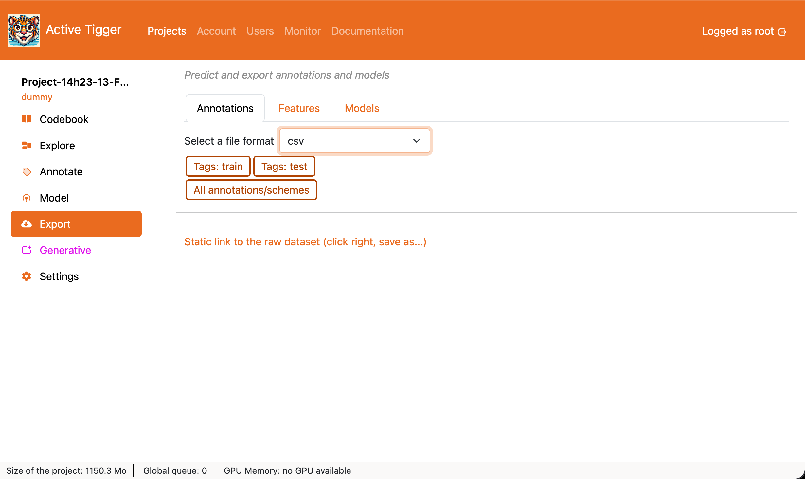
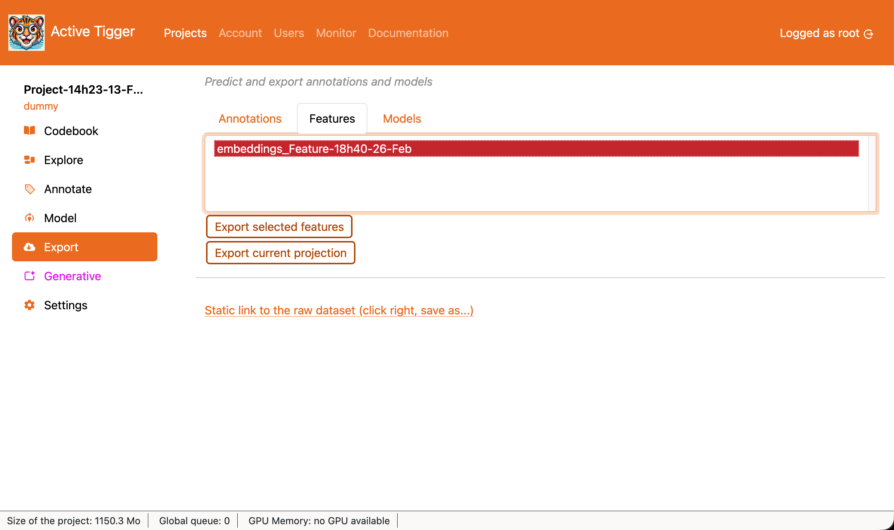
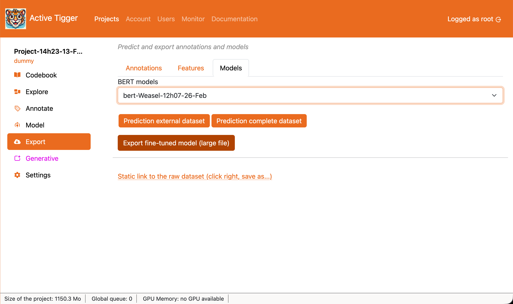

# Export page

On this page, you can export your existing data, annotations, and models.

## Annotations

This tab allows users to download annotated datasets (train, test, validation or all).

- Tags: train, Tags: test, Tags: eval to download the annotations for the train, test or validation dataset. Text inputs without an annotation are dropped. 
- All annotations/schemes to download the full dataset (train, test and eval) with all columns from the original dataset and a column per scheme. Text inputs without annotations are included.
- Static link to the raw dataset (click right, save as...) to download the full dataset (as a Parquet file) as uploaded when creating the project.

## Features

- Export selected features to download the features and the corresponding index.
- Export current projection to download the projection's nodes' coordinates computed in the [Visualisation tab of the Explore page](./explore.md#visualization) and the corresponding index.

## Models

- Prediction on external dataset to upload a new dataset and infer labels for each row using the selected model.
- Prediction on complete dataset to infer labels on the full dataset as imported upon project creation.
- Export fine-tuned model (large file) to download the weights of the fine-tuned model (good practice for reproducibility).
