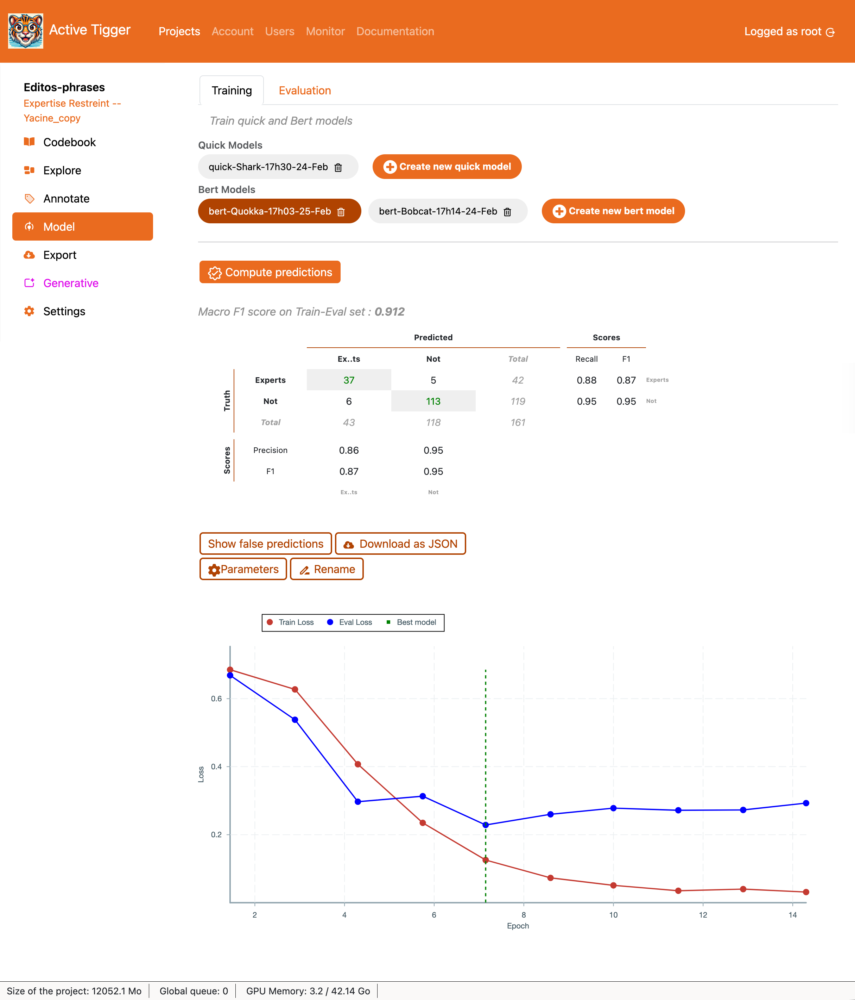

# Model Page

The panel model allow the management of model, i.e. their training and evaluation.

## Training

This section describes the Training tab, the parameters available for training as well as the key insights displayed on the page.

 

### Quick Models

The Quick Models are classification models from [scikit-learn](http://scikit-learn.org/stable/supervised_learning.html) trained on pre-computed features ([what are features?](../theoretical-concepts/index.md#representing-texts-with-features)). They are quick to train and do not require GPUs. These models can be used for Active Learning ([what is Active Learning?](../theoretical-concepts/index.md#what-is-active-learning)) in the [Annotate page](./annotate.md).

When launching a model training, the model will be trained on the subset of the train set where labels exist. There must be at least 10 (?? XXX) annotated text inputs per label. Once trained, the model will predict the labels for the rest of the train set in order to be used in Active Learning (see [Annotation page](./annotate.md#active-learning-in-practice))

Models available include: 

- [Logistic model](http://scikit-learn.org/stable/modules/generated/sklearn.linear_model.LogisticRegression.html) with L2 penalty: XXX. The parameters are: 
    - Cost: XXX
- [Logistic model](http://scikit-learn.org/stable/modules/generated/sklearn.linear_model.LogisticRegression.html) with L1 penalty: XXX. The parameters are: 
    - Cost: XXX
- [k-Nearest-Neighbors (KNN)](http://scikit-learn.org/stable/modules/generated/sklearn.neighbors.KNeighborsClassifier.html): Classifies input based on the label of the k-nearest neighbors from the trainset. The parameters are: 
    - Number of neighbors: Number of neighbors to look at to choose the label.
- [Random Forest](http://scikit-learn.org/stable/modules/generated/sklearn.ensemble.RandomForestClassifier.html): A collection of Decision Tree classifiers that splitting the input space to generate a label. The parameters are:
    - Number of estimators: The number of decision trees in the forest.
    - Max features: The number of columns from the embeddings to consider per tree. 
- [Multinomial Naive Bayes classifier](http://scikit-learn.org/stable/modules/generated/sklearn.naive_bayes.MultinomialNB.html): XXX. The parameters are:
    - Alpha: XXX
    - Fit prior: XXX

!!! warning 
    All features are scaled before fitting the Quick Model.
    Features are scalled using the [`StandardScaler` from scikit-learn](https://scikit-learn.org/stable/modules/generated/sklearn.preprocessing.StandardScaler.html#sklearn.preprocessing.StandardScaler)

On top of model-specific parameters, additional parameters can be set: 

- Name for the model: The name used as a reference in the interface. It must be unique within a project.
- Automatically balance classes: If set to True, the model will be trained on a subset of the train dataset[^2] constructed by picking an equal number of text inputs accross labels. 
- 10-fold cross validation: Computes performance test using the [10-fold cross validation technique](http://scikit-learn.org/stable/modules/cross_validation.html).
- Labels to ignore: Labels selected will be ignored. You need at least two labels to start training a model. Models with ignored labels are available for Active Learning (see [Annotation page](./annotate.md#active-learning-in-practice)). 

<!-- TODO: ADD the retraining process-->

### BERTmodel

The BERT Models are pre-trained encoders models with a classification layer [trained with the huggingface framework](https://huggingface.co/docs/transformers/tasks/sequence_classification). They can take a dozen minutes to train and require GPUs[^1]. These models can be used for Active Learning ([what is Active Learning?](../theoretical-concepts/index.md#what-is-active-learning)) in the [Annotate page](./annotate.md).

[^1]: You can train on the CPU but that would be sub-optimal.

When launching a model training, the model will be trained on the subset of the train set where labels exist. There must be at least 10 (?? XXX) annotated text inputs per label. After training, the best model (accross epochs / checkpoints) will be used to predict the labels on the whole trainset to be used in Active Learning (see [Annotation page](./annotate.md#active-learning-in-practice)).

<!-- TODO Check the save proces -->

The parameters for the model are: 

- Name for the model The name used as a reference in the interface.
- Model base: The pretrained model used for generating the embeddings. Models are loaded through the HuggingFace interface ([which models can I train?](../faq/faq.md#choose-models-made-available)). 
- Context window size: The number of token per entry. After tokenization each input is truncated/padded to match this size. If selecting Auto adjust Max context window size the window size will be calculated as the minimum between the maximum window size of the model and the length of the longest entry of the dataset.
- Epochs: The number of times the model will be train on the train dataset[^2] ([more on choosing the hyperparameters](../theoretical-concepts/index.md#which-hyper-parameters-to-choose)). 
- Learning Rate: The initial learning rate value used during training ([more on choosing the hyperparameters](../theoretical-concepts/index.md#which-hyper-parameters-to-choose)). 
- Weight Decay: The probability for a weight to not be updated during the backward propagation ([more on choosing the hyperparameters](../theoretical-concepts/index.md#which-hyper-parameters-to-choose)).
- Use GPU: If set to True, the model will be trained on GPU — _if available_.
- Batch size: The number of inputs provided to the model at once. Large batch size makes training faster but requires higher tier hardware.
- Gradient Accumulation: The number of batches used to update the weights during the backward propagation. @JULIEN
- Eval: This is the number of evaluation — scoring performance on the train-eval dataset — performed during training.
- Train-eval split size: The ratio of elements in the train dataset[^2] that will be used to assess the model performance during training.
- Label threshold: The minimum number of annotation per label required.
- Balance labels: If set to True, the train dataset[^2] will be constructed using the same number of text inputs per label.
- Loss: The loss function used optimise the model weights for training.
- Keep the best model: If set to True, the model .
- Labels to ignore: Text inputs with these labels will be dropped out of the train dataset[^2].

[^2]: Reminder: the train dataset is the subset of the train set where labels exist.

Trained BERT models are downloadable from the [Export page](./export.md#models). Users can download the model files as well as the predictions on the dataset of the project or an external dataset.

### Key insights

For both classifiers, the application displays the Macro F1-Score ([what metrics to use](../faq/faq.md#what-metrics-should-i-use)) as well as the [confusion matrix](https://en.wikipedia.org/wiki/Confusion_matrix) and scores per label ([Recall, Precision](https://en.wikipedia.org/wiki/Precision_and_recall#Precision_vs._Recall) and [F1](https://en.wikipedia.org/wiki/F-score#Definition))

!!! warning

    The performance are computed on the train-eval dataset

- Show false predictions to display the text inputs where the classification failed.
- Donwload as JSON to download the confusion matrix, scores per label and false predictions as a JSON file.
- Parameters to show the parameters of the model and the training arguments.
- Rename to rename the model.

For **BERT models only**, the application displays the [loss curve](https://en.wikipedia.org/wiki/Loss_function) ([how to read the loss curve?](../theoretical-concepts/index.md#reading-the-loss-curve)).

## Evaluation

The Evaluation tab shows similar component as the [Training](#training) tab. After selecting a classifier, Compute statistics on current annotations to compute the performance of the model on the full train, test and validation set[^3]. XXX Does it compute the prediction for the whol label? Can't remember.

The rest of the layout is similar to the one in the [Training page](#key-insights)

[^3]: Again, the text inputs with no label are removed from the train, test and validation sets before computing the performance. 
