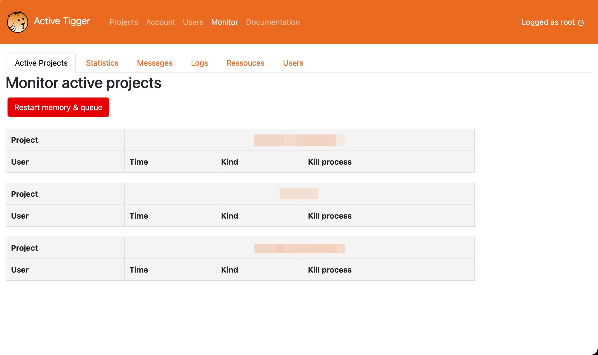
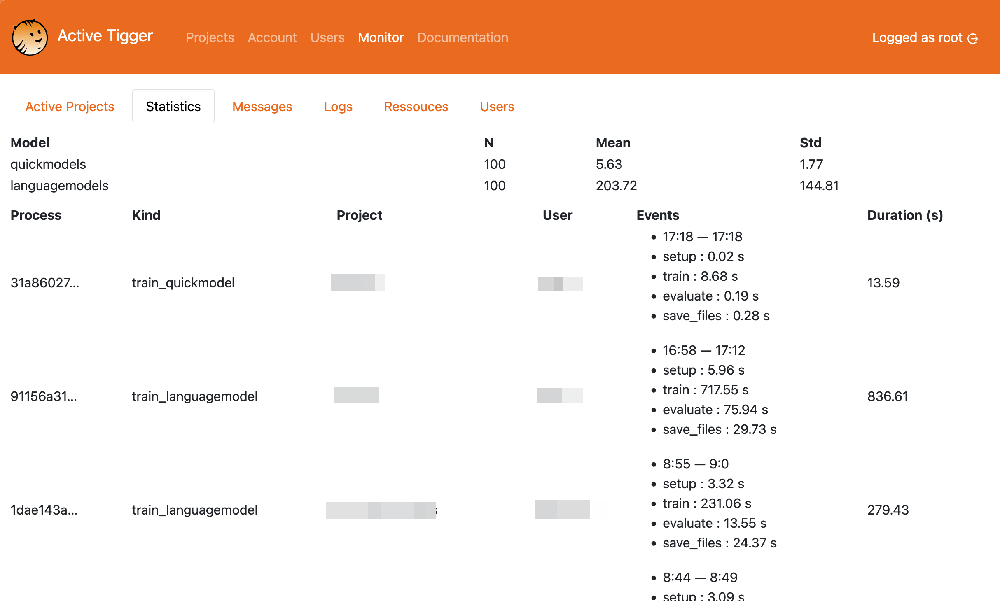
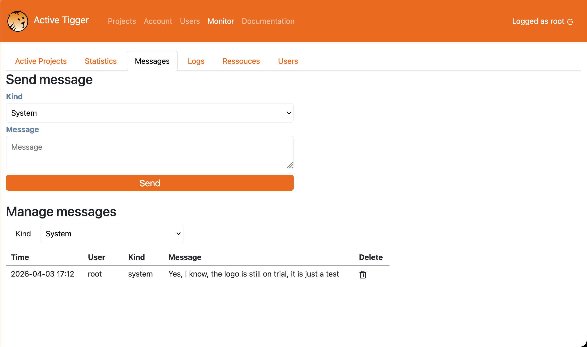

This section describes the monitoring page.

!!! warning
    Be aware, the root user can grant manager access to any project of the instance.

## Monitor page

This page is only visible by the root user. It contains multiple panels described below

### Active project tab

This page lists all projects currently in use and associated tasks (train classifiers for instance) currently running. From this tab, the root user can kill any task.

Restart memory and queue will restart the backend. All current users will be impacted and active tasks killed. 

### All projects

The list of all projects created in the instance, with the possibility for the root to grant manager access to any project.

### Statistics tab

This page lists all completed tasks and the computing time to assess the installation efficiency. Each task is associated with a user and a project.

### Messages tab

This page allows the root user to leave messages on the frontpage of the app in order to warn users of recent bugs, upcomming memory wipe or maintenance. 

### Logs tab

This page lists all actions performed (annotation, train models, inference ...) with a time stamp, and the assiociated user and project.

### Resources tab

This page lists the resources detected and usable by the app (GPU, CPU, Memory and disk).

### Users tab

This page lists the existing accounts with all the projects they are involved in as well as their role.
