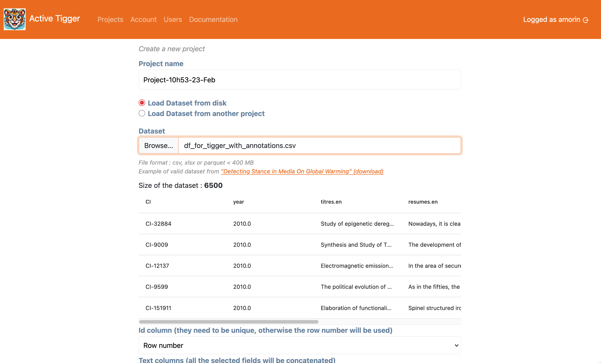

# Project Creation page

This section describes project creation

## Primary parameters

Those parameters define the general project. Some elements can be modified afterward.

- <a class="parameter">Project name</a>: Unique name to identify the project. Could be changed in [Settings page](./settings.md).
- <a class="parameter">Dataset</a>: Data to use. Can be loaded :
    - From user, format Parquet, CSV or XLSX file, limit defined by the administrator. 
    - From another project (with access right)
- <a class="parameter">Id column</a>: index to identify each element in the treatment ; either from an existing column or row number. If the chosen index is not unique, an internal index is created different from the external index.
- <a class="parameter">Text column(s)</a>: The column(s) to use as text input. If several columns are selected, content of the columns will be concatenated with two linebreaks. 
- <a class="parameter">Language of the corpus</a>: General parameter used to suggest which models to use in the treatment. 
- <a class="parameter">Column(s) for existing annotations</a>: Load existing annotations. Each column is converted to a new scheme. Elements (XXX does it change how we select elements?)
- <a class="parameter">Column(s) for contextual information</a>: Information available to display in the [annotation page](./annotate.md).
- <a class="parameter">Number of elements in the train set</a>: Sample of the general dataset used as train set
- <a class="parameter">Number of elements in the validation set (optional)</a>: Sample of the general dataset used as validation set. Used for evaluation. This sample is randomly selected from the initla dataset before the train set.
- <a class="parameter">Number of elements in the test set (optional)</a>:  Sample of the general dataset used as test set. Used for evaluation. This sample is randomly selected from the initla dataset before the train set.

After setting the compulsory parameters, clicking the "Create" button will redirect you to the [Codebook page](./codebook.md) (or the [Annotate page](./annotate.md) if you have selected column(s) for existing annotation).

## Secondary parameters

Available in the "Advanced options" panel to configure specific treatments.

- <a class="parameter">Prioritize existing labels</a>: When loading existing annotations, maximize the already annotated elements in the trainset. If there are not enough elements annotated to create all three sets, random elements will be picked. 
- <a class="parameter">Select elements at random</a>: If set to `True`, the train, validation and test sets will be created by picking elements at random. If `Prioritize existing labels` is set to `True`, this parameter is ignored.
- <a class="parameter">Stratify train set</a>: Force the stratification for the trainset ([What is stratification?](../theoretical-concepts/index.md#what-is-the-stratification-of-a-dataset)). If `Prioritize existing labels` is set to `True`, this parameter is ignored.
- <a class="parameter">Stratify test set</a>:  Force the stratification for the test set ([What is stratification?](../theoretical-concepts/index.md#what-is-the-stratification-of-a-dataset)). If `Prioritize existing labels` is set to `True`, this parameter is ignored.
- <a class="parameter">Column(s) used for stratification</a>: If `Stratify train set` and/or `Stratify test set`, the stratification will use the selected columns ([What is stratification?](../theoretical-concepts/index.md#what-is-the-stratification-of-a-dataset)). If `Prioritize existing labels` is set to `True`, this parameter is ignored.
- <a class="parameter">Drop annotations for testset</a>: If set to `True` and columns have been selected for existing annotations, the annotations of elements in the testset will be dropped. 
- <a class="parameter">Compute embeddings</a>: If set to `True`, upon creating the project, embeddings for the text inputs in the train, validation and test sets will start using [Sentence BERT](https://sbert.net/)
- <a class="parameter">Seed</a>: The seed used for all random operations in the project.