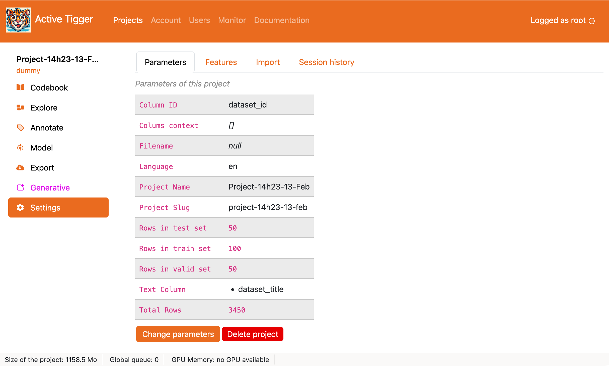
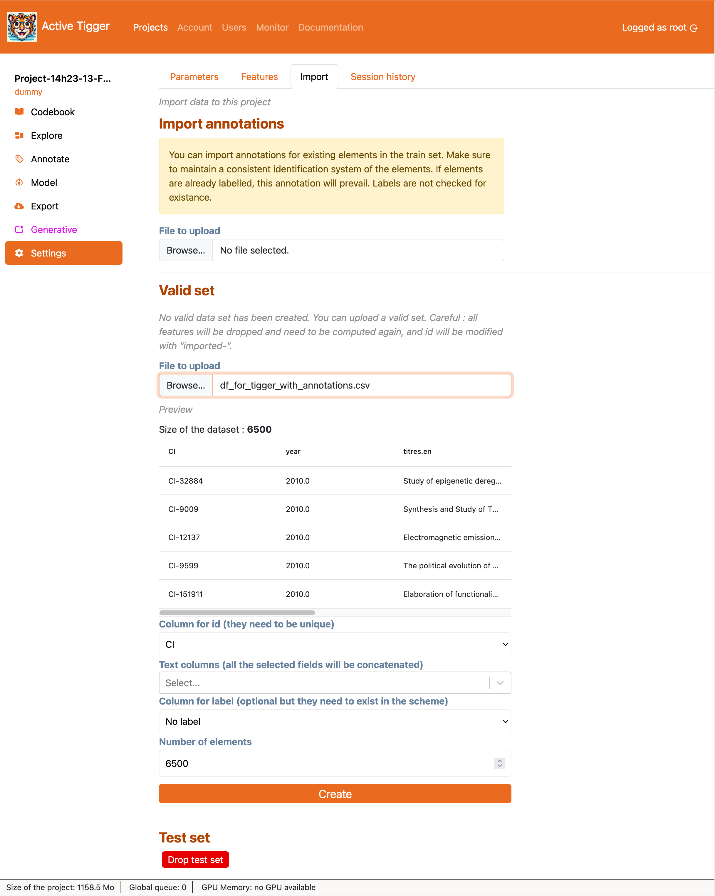

# Settings page

The settings page contains many tabs with **moderate** to **high impacts** on your project. We describe them on this page.

## Parameters

This page displays the parameters of the project and allows editing or deleting the project.

- <a class="action primary">Change parameters</a> to edit some parameters:
    - <a class="parameter">Project name</a>: [see Project Creation page](./project-creation.md#primary-parameters)
    - <a class="parameter">Text column(s)</a>: [see Project Creation page](./project-creation.md#primary-parameters)
    - <a class="parameter">Language of the corpus</a>: [see Project Creation page](./project-creation.md#primary-parameters)
    - <a class="parameter">Column(s) for contextual information</a>: [see Project Creation page](./project-creation.md#primary-parameters)
    - <a class="parameter">Add N elements in the train set</a>: Pick new elements from the dataset uploaded. XXX ⚠️ **Ignores stratification** ⚠️
- <a class="action red-danger">Delete project</a> to delete the project, annotations and models. **There is no going back.**

!!! note
    
    It is not made possible to manage the size of the sets and move elements around. Read more [here](../faq/faq.md#why-cant-i-change-the-size-of-my-sets-on-the-go)

## Features

Displays the available features and their parameters. 

- <a class="action primary">Add a new feature</a> to compute new features ([more details on the available features modes](../theoretical-concepts/index.md#what-are-features)).
    - if using **embeddings**:
        - <a class="parameter">Feature name</a>
        - <a class="parameter">Model to use</a>
        - <a class="parameter">Context window size</a>: The number of token per entry. After tokenization each input is truncated/padded to match this size.
    - if using **fasttext**:
        - <a class="parameter">Feature name</a>
        - <a class="parameter">Model to use</a>
    - if using **dfm**: Using `CountVectorizer` XXX @Julien
        - <a class="parameter">Feature name</a>
        - <a class="parameter">TF-IDF</a>: if set to True, applies TF-IDF to the feature matrix (XXX).
        - <a class="parameter">n-grams</a>: the size of n-grams to account for.
        - <a class="parmater">min term freq</a>: the minimum frequence for a n-gram to be included in the vocabulary.
        - <a class="parmater">max term freq</a>: the maximum frequence for a n-gram to be included in the vocabulary.
        - <a class="parameter">Norm</a>: if set to True, normalize the featres XXX What normalisation? before or after log ?
        - <a class="parameter">Log</a>: if set to True, apply logarithm function to the feature the featres.
    - if using **regex**: creates a boolean feature whether the regex query if found in the text input
        - <a class="parameter">Feature name</a>
        - <a class="parameter">Regex query</a>
    - if using **dataset**: imports from a column in the original dataset
        - <a class="parameter">Column to use</a>
        - <a class="parameter">Type of the feature</a>: either numerical or categorical.

Features can be downloaded from the [Export page](./export.md#features).

## Import 

The import tab allows you to import data for the current process outside of the [Project Creation page](./project-creation.md). 

- **Import annotations**: import the annotations for the text inputs in the train dataset. The IDs must match. if the labels differ, new labels will be created. XXX or ignored? no idea. If annotations already exists, they will be overwritten.
    - <a class="parameter">File to upload</a>: Parquet, CSV or XLSX file, limit defined by the administrator.
    - <a class="parameter">Column for ID</a>: column from the loaded dataset that must match the IDs from the current text inputs. XXX Internal or external? 
    - <a class="parameter">Column for annotations</a>: column from the loaded dataset that contains the annotations to import.
    - <a class="action primary">Import annotations</a> to finalise the importation.
- **Validation set** and **Test set**: drop or import the validation or test set.
    - _if a validation/test set exists_, 
        - <a class="action red-danger">Drop Test/Validation set</a>: delete the set as well as the features. They will be re-computed.
    - _if the validation/test set does not exist_
        - <a class="parameter">File to upload</a>: Parquet, CSV or XLSX file, limit defined by the administrator.
        - <a class="parameter">ID column</a>: index to identify each element in the treatment ; either from an existing column or row number. If the chosen index is not unique, an internal index is created different from the external index.
        - <a class="parameter">Text column(s)</a>: The column(s) to use as text input. If several columns are selected, content of the columns will be concatenated with two linebreaks. 
        - <a class="parameter">Column(s) for existing annotations</a>: Load existing annotations. If labels are not found in the current scheme, they will be ignored.
        - <a class="parameter">Number of elements</a>: Number of rows 