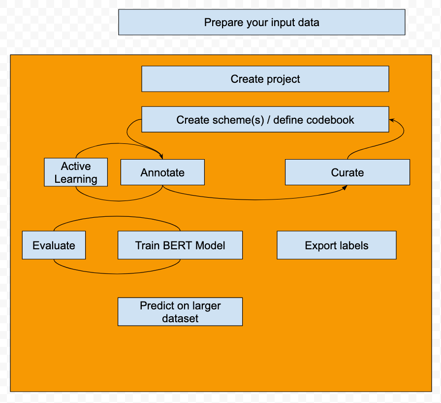

<div class="logo-div"></div>

# Who are we

Active Tigger is an **open source project** created for **social scientists** by social scientists. We design the application in **collaboration** with users to adapt to their needs. We are happy to welcome new [contributors](../software//contributors.md).

ActiveTigger is developed in the CREST research unit (CNRS, Polytechnique, ENSAE), within the [CSS@IP-Paris team](https://www.css.cnrs.fr/team/), with the help of [OuestWare](https://www.ouestware.com/) and the generous funding of DRARI Île-de-France, Progedo, and CREST.

# What we do 

ActiveTigger is an open-source software designed to support **collaborative text annotation for social sciences**, facilitating access to computational tools for research projects dealing with large amounts of text data. There are no entry requirements. 

Main functionalities: 

- Collaborative annotations of texts and project management tools.
- Fine-tune of encoder classifiers.
- Create topic analysis with [BERTopic](https://bertopic.com/).
- Use generative AI tools.

The software’s **key functionality** is <a class="highlight">Active Learning</a>, which reduces the annotation time necessary to reach high classification performance.

<!-- Potential recorded webinaire -->

!!! note "This is V1 🎉"

# Installation / Access to an instance

Two solutions exist: 

**Access [our online instance](./access.md#existing-instance).**

- Secure storage for sensitive data.
- 40 Gb VRAM for training models.
- Need an account, [get one here](https://www.css.cnrs.fr/request-an-account-on-the-crest-instance/).

**Install and run the application locally**

- Download the github depo. In the terminal, enter:
     
```
git clone https://github.com/emilienschultz/activetigger.git
```

- Move to the `activetigger` folder:

```
cd activetigger
```

- Use the production branch:

```
git checkout production
```

- Create the docker image

```
cd docker
docker compose -f docker-compose.yml -f docker-compose.dev.yml -p activetigger up
```

Go to `http://localhost:5173/`, you shoul see the app running. [More information on setting up your instance.](../software/installation.md#set-up-your-local-instance).

**Propose a test to see if it's indeed, up and running**


# Workflow



# Documentation tree

# Community

Join the discussion, share feedback and ask for new functionalities: Join us on [Discord](https://discord.gg/ybXDUtTP)!

If you face issues: Read the [FAQ](../faq/faq.md)! If you can't find an answer, ask on [Discord](https://discord.gg/ybXDUtTP)! Alternatively, open an [issue on Github](https://github.com/emilienschultz/activetigger/issues)s!

Visit out [team's website](css.cnrs.fr) to learn about other activities!