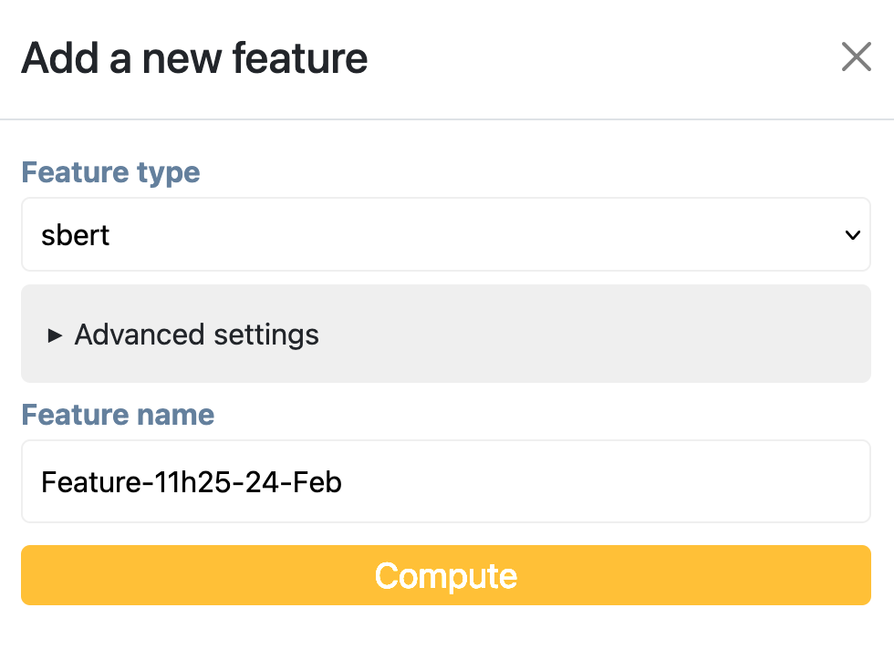

# Theoretical concepts

## Train, Validation and Test sets

XXXX

## What is the stratification of a dataset? 

Explain what ? why ? and how (in the code) ? 

## What is a scheme ?

What? In the context of the app, what difference does it make? 

## Available scheme types

XXX

## What is a projection?

XXX

### What is t-SNE?

XXX https://en.wikipedia.org/wiki/T-distributed_stochastic_neighbor_embedding 

### What is UMAP?

XXX

### What is UMAP?

## What is HDBSCAN

## What are features 

XXXX

### Compute new features 

## Should I scale my features?

XXX

## What is a topic model 

XXX

## What is Active Learning? 

## Choose hyper parameters

## What metrics to use ?

## Read the loss curve